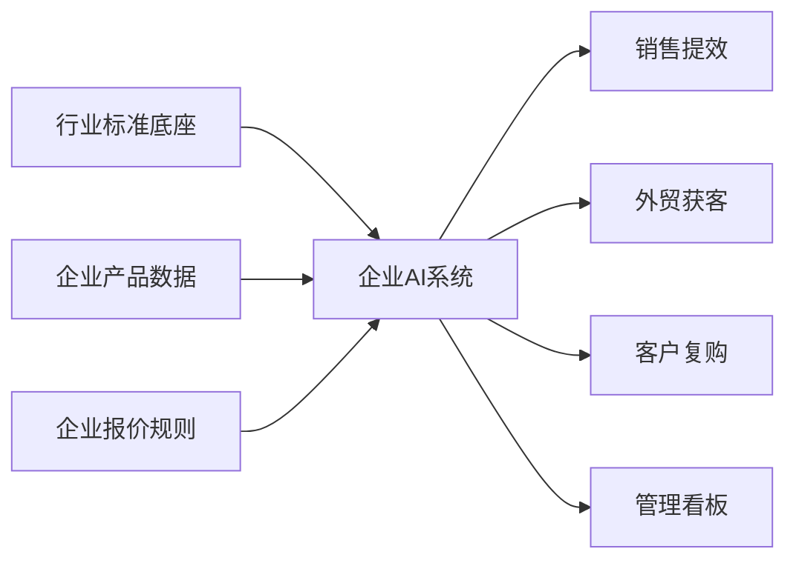
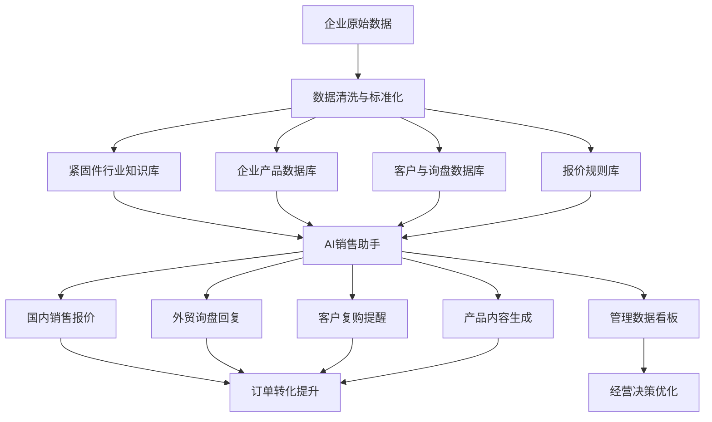
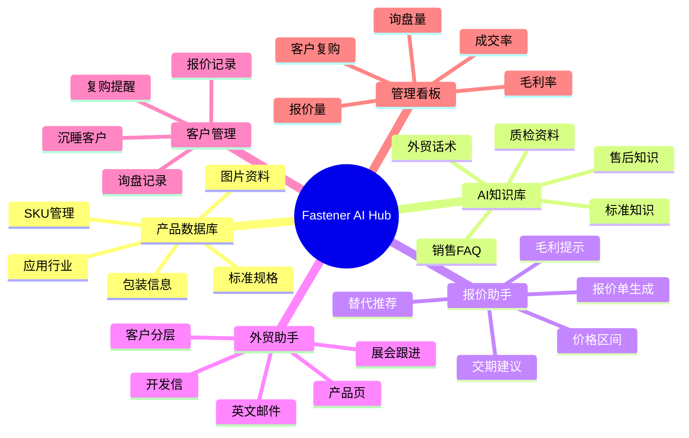
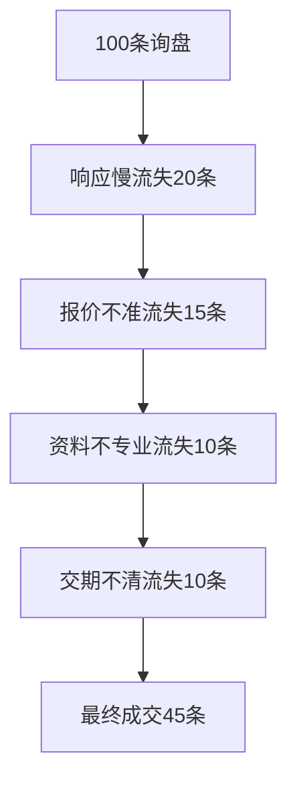
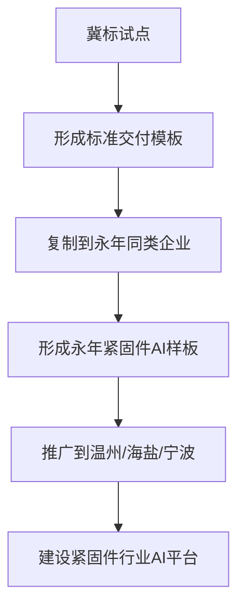
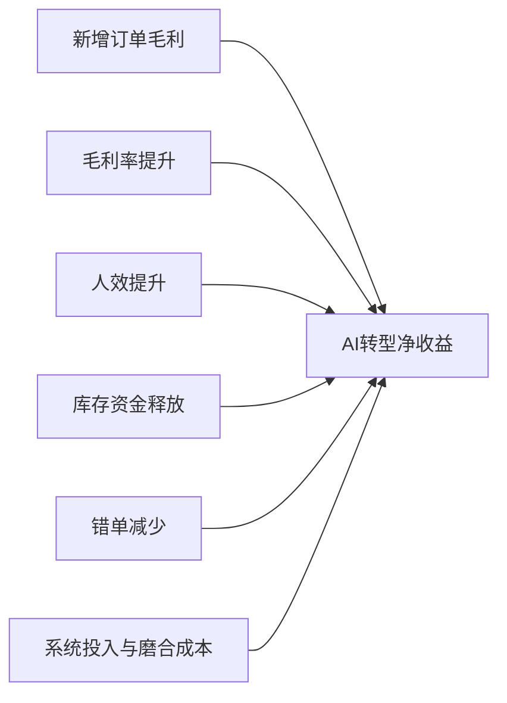
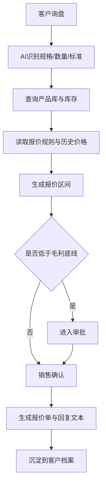
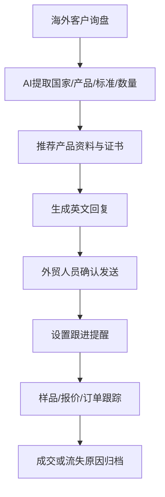

# 紧固件行业AI转型可复制推广方案

项目名称：Fastener AI Hub 紧固件AI销售与知识库中台

适用对象：紧固件生产企业、经销商、外贸企业、产业园区、行业协会、工业品平台

参考样板：永年冀标紧固件制造有限公司AI数字化转型一期项目

文档版本：V1.0

编制日期：2026年5月7日

---

## 1. 方案总览

### 1.1 核心判断

紧固件行业AI转型项目具备复制推广价值，但不是简单复制系统界面，而是复制“行业共性能力 + 标准实施方法 + 企业个性化配置”的整体方案。

推荐复制模型：

`行业AI底座 + 企业产品数据 + 企业报价规则 + 企业客户资料 = 可交付AI转型系统`

推广原则：

- 70%标准化复制。
- 30%企业个性化配置。
- 先做标杆企业，再做产业带推广。
- 先解决销售、报价、外贸、客户复购，再逐步扩展到库存、ERP、质检和本地化部署。

### 1.2 为什么紧固件行业适合复制推广

| 行业特征 | 紧固件行业表现 | 复制适配度 |
|---|---|---|
| SKU多 | 螺栓、螺母、螺钉、垫圈、非标件规格极多 | 高 |
| 标准复杂 | GB、DIN、ISO、ANSI、JIS、UNC、UNF等并存 | 高 |
| 报价频繁 | 询盘多、单价低、客户比价快 | 高 |
| 客户复购强 | 经销商、工厂、MRO客户持续采购 | 高 |
| 数字化基础弱 | 许多企业仍依赖Excel、微信、个人经验 | 高 |
| 产业带集中 | 永年、温州、海盐、宁波等集群明显 | 高 |
| 外贸共性强 | 英文资料、报价、展会跟进、合规文件需求相似 | 高 |

### 1.3 一句话定位

把紧固件企业分散的产品、标准、报价、客户和外贸经验，转化为可查询、可报价、可复购、可推广的AI经营系统。

---

## 2. 产品定位

### 2.1 产品名称

推荐名称：

**Fastener AI Hub 紧固件AI销售与知识库中台**

可选名称：

| 名称 | 定位 |
|---|---|
| 紧固件AI销售中台 | 偏企业内部销售提效 |
| Fastener AI Hub | 偏外贸和国际化 |
| 永年紧固件AI产业大脑 | 偏政府园区和产业带 |
| 标准件AI报价与知识库系统 | 偏实用型B2B软件 |
| 紧固件产业数字化增长平台 | 偏招商和产业升级 |

### 2.2 目标客户

| 客户类型 | 核心需求 | 推荐版本 |
|---|---|---|
| 生产型紧固件企业 | 提升报价效率、销售能力、客户复购 | 标准版 |
| 外贸型紧固件企业 | 提升英文获客、产品页、展会跟进 | 标准版 |
| 经销商/批发商 | 快速查货、报价、客户管理 | 基础版 |
| 龙头企业 | 打通ERP、CRM、库存和报价审批 | 增强版 |
| 产业园区/协会 | 推动区域企业数字化升级 | 产业带版 |
| 工业品平台 | 提升标准件搜索、选型、转化能力 | 平台接口版 |

---

## 3. 复制推广逻辑

### 3.1 行业共性模块

这些模块可一次沉淀，多家企业复用：

| 模块 | 可复制程度 | 说明 |
|---|---:|---|
| GB/DIN/ISO/ANSI标准知识库 | 高 | 形成行业标准问答底座 |
| 螺栓、螺母、垫圈、螺钉分类体系 | 高 | 统一产品分类与字段 |
| 英文产品描述模板 | 高 | 用于独立站、阿里国际站、样册 |
| 报价单/PI/开发信模板 | 高 | 外贸销售高频使用 |
| 外贸客户跟进流程 | 高 | 展会、询盘、样品、复购跟进 |
| 销售FAQ | 高 | 常见规格、交期、包装、证书问题 |
| 产品图片命名规范 | 高 | 支持电商和知识库管理 |
| 客户分层模型 | 高 | 按利润、复购、地区、行业分类 |
| 询盘识别模型 | 高 | 从客户文本中提取规格、标准、数量 |

### 3.2 企业个性模块

这些模块需要每家企业单独配置：

| 模块 | 个性化内容 |
|---|---|
| 产品库 | 主营SKU、库存、包装、常备规格 |
| 报价规则 | 成本、毛利底线、客户等级 |
| 客户库 | 老客户、渠道商、区域市场 |
| 品牌资料 | 工厂图片、证书、样册、案例 |
| 权限体系 | 谁能看价格、成本、客户 |
| ERP/库存接口 | 不同企业系统不同 |

### 3.3 复制推广模型图

---

## 4. 整体系统架构

### 4.1 系统架构图

### 4.2 产品模块图

---

## 5. 核心功能设计

### 5.1 行业标准知识库

| 功能 | 说明 |
|---|---|
| 标准查询 | 查询GB、DIN、ISO、ANSI标准 |
| 规格换算 | 公制、英制、美制规格转换 |
| 替代推荐 | 推荐相近标准或库存替代 |
| 材质解释 | 碳钢、不锈钢、合金钢、强度等级 |
| 表面处理说明 | 发黑、镀锌、热镀锌、达克罗等 |
| 应用场景 | 家具、机柜、机械、钢结构、MRO |

### 5.2 企业产品数据库

| 功能 | 说明 |
|---|---|
| SKU管理 | 统一产品编码和命名 |
| 库存字段 | 常备库存、生产周期、MOQ |
| 包装字段 | 纸箱、托盘、唛头、条码 |
| 图片管理 | 白底图、包装图、工厂图 |
| 电商字段 | 中文关键词、英文关键词、SEO标题 |
| 证书文件 | 材质单、检测报告、ISO证书 |

### 5.3 AI报价助手

| 功能 | 说明 |
|---|---|
| 智能识别询盘 | 从客户文字中提取规格、数量、标准 |
| 报价区间 | 给出建议报价，不替代最终决策 |
| 毛利提醒 | 低于底线自动预警 |
| 历史价参考 | 展示同类客户历史成交价 |
| 替代方案 | 推荐现货或相近规格 |
| 报价单生成 | 自动生成中英文报价文本 |

### 5.4 外贸AI助手

| 功能 | 说明 |
|---|---|
| 英文邮件 | 报价、开发、催单、售后、展会跟进 |
| 多语种支持 | 英语为主，可扩展西语、俄语、阿语 |
| 产品页生成 | 独立站、阿里国际站、Google SEO内容 |
| 客户国家识别 | 根据国家生成不同沟通风格 |
| 贸易条款模板 | FOB、CIF、EXW、付款条款 |
| 证书提醒 | 根据市场提示客户可能需要的文件 |

### 5.5 客户复购系统

| 功能 | 说明 |
|---|---|
| 客户画像 | 国家、行业、产品、频率、金额 |
| 复购周期 | 根据历史订单自动判断 |
| 沉睡提醒 | 超过周期未采购自动提醒 |
| 跟进话术 | AI生成微信/邮件/电话话术 |
| 机会评分 | 根据询盘质量判断优先级 |
| 流失原因 | 价格、交期、质量、付款等分类记录 |

---

## 6. 标准化交付包

### 6.1 基础版

适合小型紧固件企业、经销商。

| 内容 | 说明 |
|---|---|
| 核心SKU | 50个 |
| AI知识库 | 产品FAQ、标准资料、销售话术 |
| 报价模板 | Excel/在线表单 |
| 外贸模板 | 英文开发信、报价邮件 |
| 部署方式 | SaaS/云端知识库 |
| 周期 | 30-45天 |
| 价格建议 | 5万-15万元/家 |

### 6.2 标准版

适合生产+销售+外贸型企业。

| 内容 | 说明 |
|---|---|
| 核心SKU | 100-300个 |
| AI知识库 | 产品、标准、销售、质检、外贸 |
| 报价助手 | 价格区间、毛利提示、交期建议 |
| 客户管理 | 询盘、报价、复购提醒 |
| 外贸内容 | 英文产品页、独立站内容、开发信 |
| 部署方式 | 私有知识库/云端混合 |
| 周期 | 60-90天 |
| 价格建议 | 20万-60万元/家 |

### 6.3 增强版

适合规模企业、产业园区、龙头企业。

| 内容 | 说明 |
|---|---|
| 核心SKU | 500-2000个 |
| 系统接口 | ERP、库存、CRM |
| AI报价 | 成本、历史价、客户等级、审批 |
| 数据看板 | 销售、毛利、复购、库存 |
| 外贸系统 | 多语言产品页、客户开发、展会跟进 |
| 本地化部署 | 可选GPU服务器/私有云 |
| 周期 | 3-6个月 |
| 价格建议 | 80万-300万元/项目 |

---

## 7. 推广场景

### 7.1 单企业推广

目标：帮助一家企业提升销售和外贸效率。

| 企业类型 | 切入点 |
|---|---|
| 标准件工厂 | 报价效率、库存协同 |
| 外贸企业 | 英文获客、客户跟进 |
| 经销商 | 快速查货、复购管理 |
| 非标件企业 | 图纸识别、询盘管理 |

### 7.2 产业带推广

目标：面向永年、温州、海盐等产业集群批量推广。

| 模式 | 说明 |
|---|---|
| 政府/协会牵头 | 做行业AI公共知识库 |
| 龙头企业示范 | 先做标杆案例，再复制给上下游 |
| 服务商运营 | 提供标准化交付和培训 |
| 园区补贴 | 降低中小企业首期投入 |

### 7.3 平台型推广

目标：与B2B平台、工业品平台、跨境平台合作。

| 平台 | 可提供能力 |
|---|---|
| 1688/阿里国际站 | 产品内容优化、询盘回复 |
| 工业品商城 | AI选型、标准件推荐 |
| 独立站 | SEO内容、英文产品页 |
| CRM/ERP服务商 | 行业AI插件 |

---

## 8. 可视化图表库

### 8.1 行业痛点漏斗图

用途：说明紧固件企业从询盘到成交的损耗路径。

### 8.2 AI转型前后对比图

| 业务环节 | 转型前 | 转型后 |
|---|---|---|
| 查产品 | 靠经验/Excel | AI问答 |
| 报价 | 手工计算 | AI建议区间 |
| 外贸邮件 | 人工写 | AI生成初稿 |
| 客户跟进 | 靠记忆 | 系统提醒 |
| 产品资料 | 分散文件 | 统一知识库 |
| 管理决策 | 看结果 | 看过程数据 |

### 8.3 经营收益瀑布表

用途：说明按年营收1亿元企业测算的投资回报。

| 收益项 | 金额 |
|---|---:|
| 新增订单毛利 | +100万元 |
| 毛利率提升 | +80万元 |
| 人效提升 | +50万元 |
| 库存释放 | +100万元 |
| 错单减少 | +30万元 |
| 系统投入 | -60万元 |
| 年净改善 | +300万元 |

### 8.4 经营影响测算表

| 项目 | 不做AI转型 | 做AI一期转型 | 年度差距 |
|---|---:|---:|---:|
| 年营收 | 9500万-1.03亿元 | 1.06亿-1.12亿元 | +600万-1700万元 |
| 综合毛利率 | 下降0.5-1.5个百分点 | 提升0.5-1.5个百分点 | 差距1-3个百分点 |
| 毛利额 | 约1100万-1200万元 | 约1325万-1510万元 | +125万-410万元 |
| 询盘响应 | 2小时-24小时 | 30分钟内 | 成交机会提升 |
| 报价效率 | 维持现状 | 提升50%以上 | 多出3-8名销售产能 |
| 库存资金占用 | 基本不变 | 释放5%-10%库存资金 | 约75万-150万元 |
| 外贸获客 | 依赖展会、老客户、平台询盘 | 增加内容获客、AI开发信、独立站线索 | 年增200万-800万元订单机会 |

### 8.5 实施路线甘特图

| 阶段 | 第1月 | 第2月 | 第3月 | 第4-6月 |
|---|---|---|---|---|
| 数据整理 | ● |  |  |  |
| 知识库搭建 | ● | ● |  |  |
| 销售试点 |  | ● | ● |  |
| 报价助手 |  | ● | ● |  |
| 外贸助手 |  | ● | ● |  |
| CRM/库存扩展 |  |  |  | ● |

### 8.6 客户分层矩阵

|  | 高复购 | 低复购 |
|---|---|---|
| 高利润 | 重点维护 | 重点开发 |
| 低利润 | 自动化服务 | 控制投入 |

### 8.7 产业带复制路径图

### 8.8 AI转型收益公式图

计算公式：

`AI转型收益 = 新增订单毛利 + 毛利率提升 + 人效提升 + 库存资金释放 + 减少错单损失 - 系统投入 - 管理磨合成本`

### 8.9 报价流程图

### 8.10 外贸询盘处理流程图

---

## 9. 商业模式设计

### 9.1 项目制

| 模式 | 收费建议 | 适用阶段 |
|---|---:|---|
| 基础版 | 5万-15万元 | 早期获客、轻量交付 |
| 标准版 | 20万-60万元 | 主力交付方案 |
| 增强版 | 80万-300万元 | 龙头企业、园区项目 |

### 9.2 SaaS订阅制

| 版本 | 收费建议 |
|---|---:|
| 单企业基础版 | 3000-8000元/月 |
| 专业版 | 8000-20000元/月 |
| 集团/园区版 | 3万-10万元/月 |

### 9.3 产业带平台制

| 收费对象 | 收费方式 |
|---|---|
| 企业 | 年费 + 实施费 |
| 政府/园区 | 平台建设费 |
| 协会 | 会员服务费 |
| 平台 | API调用费/数据服务费 |

---

## 10. 推广路线

### 10.1 第一阶段：冀标标杆样板

周期：90天。

目标：做出可展示、可复用、可证明ROI的样板。

交付：

- 100个核心SKU产品库。
- AI知识库。
- AI报价助手。
- 外贸AI助手。
- 客户复购提醒。
- 经营收益看板。
- 前后对比案例。

### 10.2 第二阶段：形成标准产品包

周期：3-6个月。

目标：把冀标项目沉淀成可复制模板。

交付：

- 产品字段模板。
- 实施SOP。
- 报价规则模板。
- 外贸内容模板。
- 行业知识库模板。
- 培训手册。
- 销售演示PPT。

### 10.3 第三阶段：永年产业带推广

周期：6-12个月。

目标：复制到10-30家企业。

方式：

- 与协会/园区合作。
- 组织AI转型公开课。
- 用冀标案例做示范。
- 提供基础版低门槛套餐。
- 对重点企业做标准版实施。

### 10.4 第四阶段：行业平台化

周期：12-24个月。

目标：形成紧固件行业AI平台。

方向：

- 紧固件AI选型平台。
- 标准件智能报价系统。
- 跨境外贸获客系统。
- 产业带供应链数据平台。
- 工业品平台API能力。

---

## 11. 复制推广风险与解决方式

| 难点 | 说明 | 解决方式 |
|---|---|---|
| 企业数据太乱 | 每家产品命名、价格、客户资料不同 | 建标准模板 |
| 销售不愿录入 | 怕麻烦，怕客户被公司掌握 | 先让系统帮销售赚钱 |
| 老板期望过高 | 想马上看到订单 | 先设90天试点指标 |
| 标准资料版权 | 部分标准文件不能随意商业化复制 | 使用企业自有资料和合规来源 |
| 报价规则敏感 | 每家企业毛利和成本不同 | 企业私有配置 |
| 外贸市场差异 | 欧美、中东、东南亚客户需求不同 | 按市场配置模板 |
| 服务商交付能力 | 不懂紧固件会做成通用CRM | 必须沉淀行业词库和样例 |

---

## 12. 项目成功指标

### 12.1 单企业成功指标

| 指标 | 目标 |
|---|---|
| 核心SKU整理 | 50-300个 |
| 常规询盘响应 | 30分钟内 |
| 报价效率 | 提升50%以上 |
| 英文邮件效率 | 提升50%以上 |
| 客户复购提醒 | 覆盖重点老客户 |
| 毛利率改善 | 提升0.5-1.5个百分点 |
| 年净经营改善 | 150万-350万元，按年营收1亿元测算 |

### 12.2 产业带成功指标

| 指标 | 目标 |
|---|---|
| 标杆企业 | 1-3家 |
| 复制企业 | 10-30家 |
| 标准产品模板 | 1套 |
| 行业知识库 | 1套 |
| 培训体系 | 公开课、手册、视频 |
| 平台能力 | 支持多企业、多权限、多知识库 |

---

## 13. 最终结论

紧固件行业AI转型具备较强复制推广可能性。真正有价值的不是给每家企业重复开发系统，而是沉淀一套紧固件行业AI底座：

- 紧固件标准知识库。
- 产品分类和SKU模板。
- 报价辅助逻辑。
- 外贸获客模板。
- 客户复购模型。
- 实施SOP。
- 行业数据看板。

永年冀标如果先完成内部试点，并形成可展示的经营改善数据，就可以从“使用AI的紧固件企业”升级为“紧固件行业AI转型样板企业”。后续可通过永年产业带、行业协会、工业品平台和外贸服务商渠道进行复制推广。

